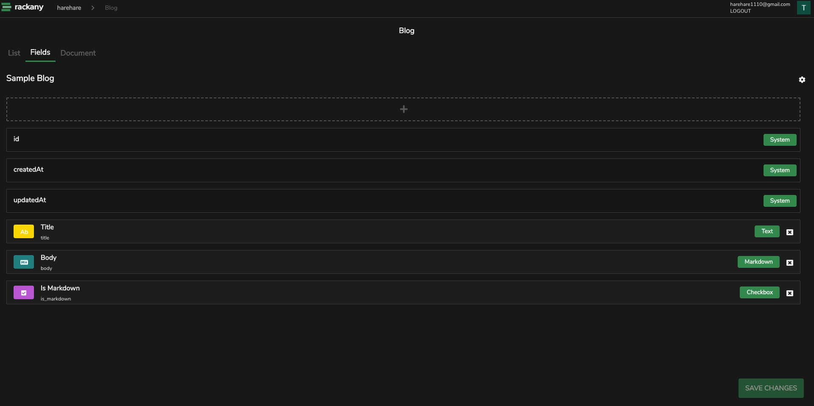

# rackany

Build your own database


Define arbitrary fields and publish a restful api. no coding required.



## Getting Started

### Development

```bash
$ npm run dev
```

Open http://localhost:8000 and start modifying the code in /web/src.

### Requirements1

**Database:**

- MySQL >= 5.6
- MariaDB >= 10.1
- PostgreSQL >= 10
- SQLite >= 3
- Cloud Firestore

## TODO :construction:

- [ ] Add CLI
- [ ] Add user management functions
- [ ] Add full text search
- [ ] Add Document

## License

[MIT](http://opensource.org/licenses/MIT)
